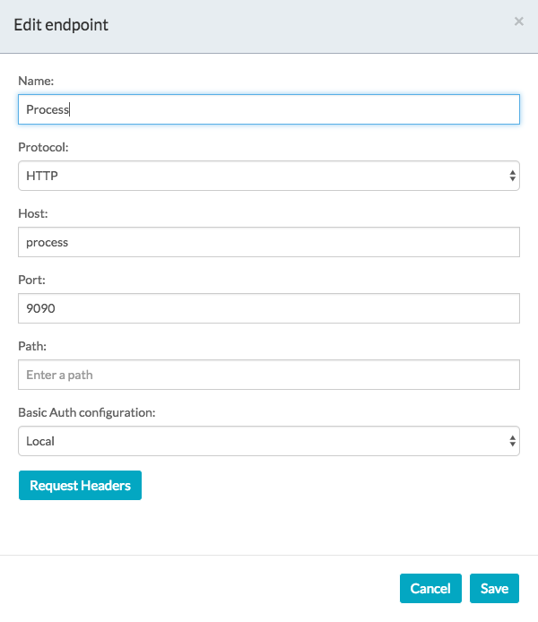

# Start Signal Event with REST example
## This example will demonstrate how to throw a signal in the global scope of the tenant for other processes to catch.

I am going to show one example of how to use a signal to start a process, but there a several ways to use the signal event.

You may choose to send a REST signal instead of using the rest call when there are several process you wish to start at the same time or you don't know the ID of the process you want to start.

### Configuring the REST call
1. Define the REST endpoint under "Endpoints" in the Identity Management > Tenants > Endpoints section

1. Define the REST header authentication in the under "Basic Auths" in the Identity Management > Tenants > Endpoints section


1. In your process, add a REST call task activity.
1. Configure the REST call task:
  1.  Request mapping:
    The JSON of the request mapping should be similar to:
    ```
      {
          "signalName":"mysignal",
          "tenantId":"tenant_1",
          "async":"true",
          "variables":
            [
              {
                "name":"varFromSignal",
                "value":"This is a string"
              }
            ]
      }
      ```
      The values are:
      signalName - The name of the signal you are throwing and catching. You will need to define this in the process that you want to catch the signal.
      tenantId - The ID of the tenant in which to throw the signal. In a non-MT environment, the tenantId will be "tenant_1"
      async - If you want the throw to be executed asynchronously
      variables - Any variables you want to pass to catch events. You will need to define these in the catch process.
  1. Request header:
    Header name: Content-Type
    Header value: application/json
  1. Endpoint:
    HTTP method: POST
    Base endpoint: http://<aps_host>:<aps_port>
    Rest URL: /activiti-app/api/runtime/signals?tenantId=<your_tenant_id>

    
  1. REST configuration is complete

### Configuring the Start Signal Event
1. In the editor for the process that will catch the signal, open up the signal definition and add a new signal:

1. The signal name needs to match what you defined in the REST call, or vice versa:

  1. The scope needs to be global
1. Next, add a Start Signal Event to the process
1. Under the configuration for the event, select your defined signal from the drop down under Signal Reference

1. If you are passing variables with the signal, as defined in your REST call, define those variables in the global space of the process
1. Build out the rest of your process
